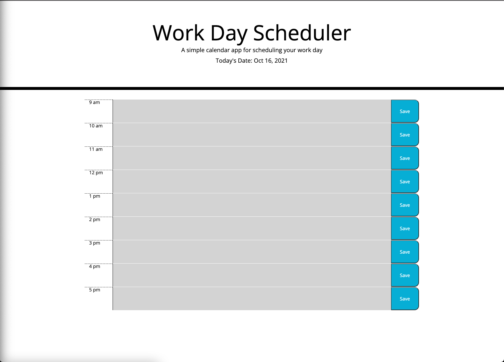

# Work Day Scheduler

## Description
The objective of this project was to create a simple calendar application that allows a user to save events for each hour of the day. This app runs in the browser and features dynamically updated HTML and CSS powered by jQuery and Moment.js. The text area is greyed out if the time block is in the past, is green if the time block is in the future, and is red if the time block is the present.

[Deployed Application](https://reginaldcapanzana.github.io/work-day-scheduler/)